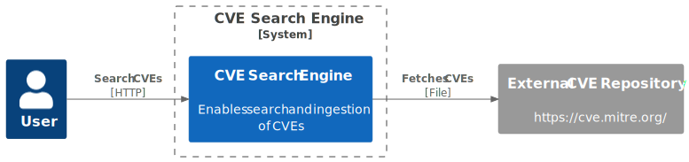
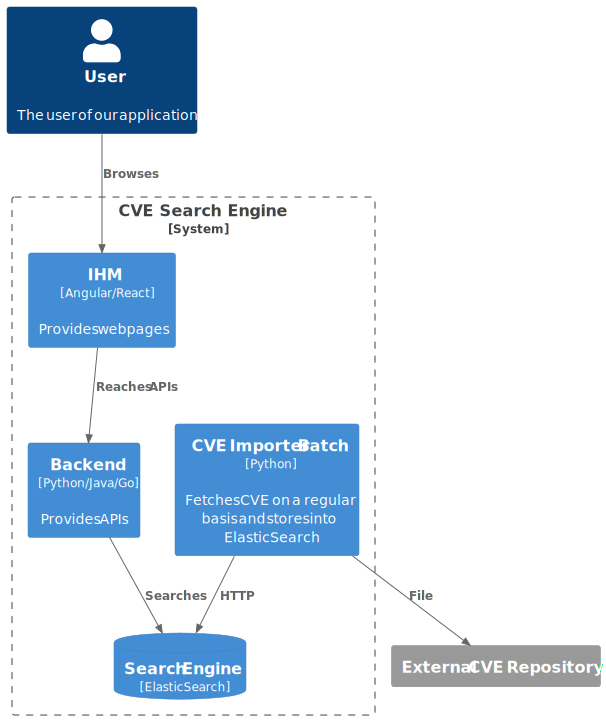

This bootcamp/workshop aims to develop the following skills:

* Git Configuration management
* Design
* Backend development
* Front end development
* Elasticsearch management & configuration

# The use case

During this workshop, we will code a full search engine.
It will enable searching in a CVE repository.

# Architecture of the solution

## Context
Here is the high level design:

### Explanation

The system is reachable by a web interface enabling searching into a CVE search engine.

We can search with any criteria we want.

## Containers

## Explanation

### Search Engine
It's based on ElasticSearch.

You can use it through Docker.
Check out this [documentation](https://www.elastic.co/guide/en/elasticsearch/reference/current/getting-started.html).

## CVE Importer Batch

This program aims to:
1. Download latest CVE export from https://www.cve.org/Downloads
2. Store them into ElasticSearch through its API

## Backend
This program aims to 
1. Expose APIs to search CVEs from ElasticSearch

## Front end

This program aims to:
2. Provide a GUI to reach the API.

# Workshop

> [!IMPORTANT]
> Please submit your code in a dedicated branch through a [Pull Request](https://docs.github.com/en/pull-requests/collaborating-with-pull-requests/proposing-changes-to-your-work-with-pull-requests/creating-a-pull-request)
>

## Step 1
## Design
1. Start listing all the use cases
2. For each use case follow the agenda below

### Use case documentation

Here is how to describe a use case:

1. Textual description
2. Use case schema 
3. Activity diagram of the use case and a textual description of all the implied activities
4. Sequence diagram

> [!INFO]
> You can write a document following into the [docs/step1](./docs/step1) folder based on [this template](./docs/design_template.md) 
> You can them write your documentation using the [markdown format](https://www.markdownguide.org/) 
> For your diagrams, include them as an image. You can also use [PlantUML](https://plantuml.com/) (not required)
>

